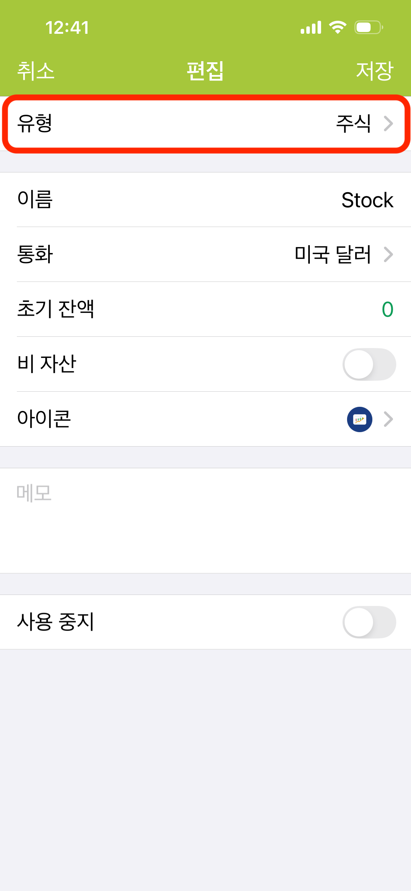

---
metaLinks:
  alternates:
    - >-
      https://app.gitbook.com/s/Hseb2PqmAac4uS7KJtxo/guides/icloud-yun-zhang-ben-she-ding
---

# 주식 계좌 만들기

주식 계좌는 주식 투자를 기록하기 위한 전용 계좌입니다.

1. **계좌** 페이지로 이동하여 우측 상단의 \*\*＋\*\*를 탭해 새 계좌를 만듭니다. 
2.  계좌 유형으로 **주식**을 선택합니다. 

    
<figure><figcaption></figcaption></figure>

3. 계좌 이름을 입력합니다 (예: 대만 주식, 미국 주식).
4.  계좌 통화를 선택합니다.

    > **팁:** 통화에 따라 사용 가능한 시장이 결정됩니다. 예를 들어 대만 달러(TWD)로 설정하면 시스템이 자동으로 대만 주식 시장을 목록에 표시합니다.
5. 저장하면 계좌 목록에 해당 계좌가 나타납니다. 탭하면 주식 자산 관리로 진입합니다.
