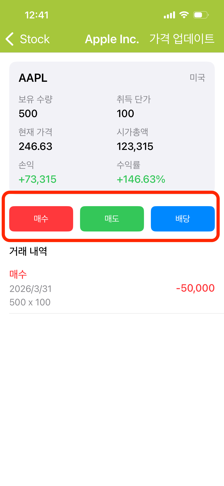

---
metaLinks:
  alternates:
    - https://app.gitbook.com/s/Hseb2PqmAac4uS7KJtxo/guides/shou-dong-tong-bu
---

# 거래 기록 (매수 / 매도 / 배당)

보유 종목을 탭하여 개별 종목 상세 페이지로 진입합니다. 페이지 중앙에 **매수**, **매도**, **배당** 세 가지 버튼이 있어 각 거래를 개별적으로 기록할 수 있습니다.

<figure><figcaption></figcaption></figure>

 

 
